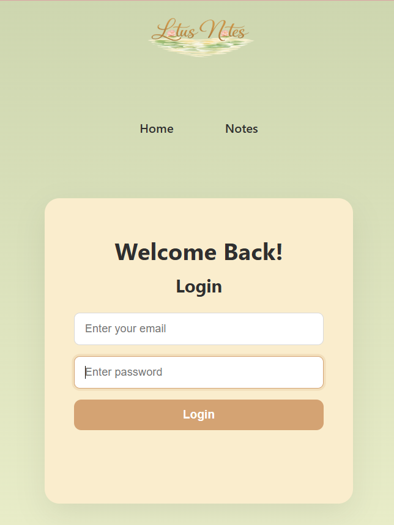
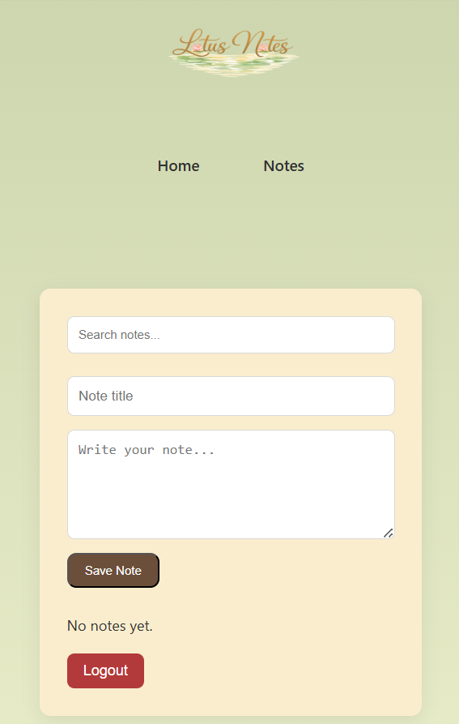
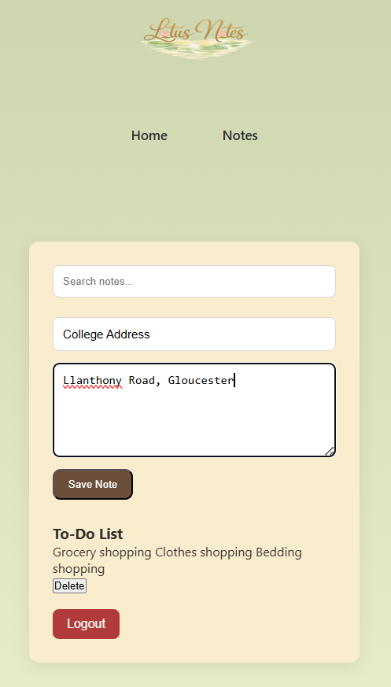

# Lotus Notes – Secure Notes Web Application

A full-stack secure notes application that allows users to create, view, and manage personal notes after authenticating with their email and password. Each user’s notes are securely stored in a database and isolated from other users.

This project demonstrates practical teamwork experience building a **full-stack JavaScript application** with a frontend, backend API, and database integration.

---
# Contributors
Kim - Add your role
Delali - Backend architecture and Integragtion, Database Design, and UI efficiency 

# Overview

Lotus Notes is a web-based note-taking application designed to help users securely store and manage personal notes. The application supports user authentication and ensures that each user's notes are stored and retrieved securely from the backend database.

The project evolved from a simple browser-based note system using local storage to a **multi-user database-driven application**, providing experience with backend development, API communication, and debugging real-world issues.

---

# Features

* User signup and login with email and password
* Secure session management
* Create and store personal notes
* Delete notes
* Notes stored in a database per user
* Protected routes preventing unauthorized access
* Logout functionality
* Auto logout after inactivity
* Modular JavaScript architecture using ES Modules

---

# Tech Stack

Frontend

* HTML
* CSS
* JavaScript

Backend

* Node.js
* Express.js

Database

* MongoDB

Development Tools

* Visual Studio Code
* MongoDB VS Code Extension
* Browser Developer Tools

---

# Project Architecture

Client (Frontend)

* Handles user interface
* Sends API requests to the backend
* Displays notes returned from the server

Server (Backend)

* Handles authentication
* Processes note creation and deletion
* Communicates with the database

Database

* Stores users and notes collections
* Associates notes with specific user IDs

Example application flow:

```
User logs in
     ↓
Frontend sends login request
     ↓
Server validates credentials
     ↓
User session established
     ↓
User creates notes
     ↓
Notes stored in MongoDB
     ↓
Frontend fetches user-specific notes
```

---

# Installation and Setup

Clone the repository:

```
git clone https://github.com/KimberlyM076/secure-notes-app.git
```

Navigate to the project folder:

```
cd lotus-notes-app
```

Install dependencies:

```
npm install
```

Start the server:

```
node server.js
```

Open the application in your browser:

```
http://localhost:5000
```

---

# Folder Structure

```
lotus-notes-app
│
├── Backend
│   ├── models
│   │   └── User.js
│   │   └── Notes.js
│   ├── node_modules
│   ├── .env
│   ├── .gitignore
│   ├── server.js
│   │── package.json
│   └── package-lock.json
│       
├── css
│   └── style.css
|
├── js
│  ├── auth.js
│  ├── notes.js
|  ├── main.js
|  ├── storage.js
|  └── crypto.js
|
├── images (folder for all images used in the app)
|
├── index.html
├── notes.html
├── login.html
├── manifest.json
├── service-worker.js
├── documentation.md
├── Project Development Log.docx
├── README.md

```

---

# Key Learning Outcomes

This project provided hands-on experience with full-stack development concepts including:

* Building RESTful APIs
* Integrating a frontend with a backend server
* Managing application state across client and server
* Implementing user authentication
* Working with a NoSQL database
* Structuring modular JavaScript applications
* Debugging frontend and backend integration issues

During development several real-world issues were identified and resolved, including:

* Duplicate event listeners causing repeated API requests
* Browser ES module import errors
* Synchronization issues between local storage and database storage
* Ensuring users only access their own notes

---

# Future Improvements

Planned improvements include:

* JWT-based authentication
* Password hashing and improved security
* Note editing functionality
* Search and filtering for notes
* Rich text support for note content
* Deployment to a cloud platform
* OAuth login (Google or GitHub)

---

# Screenshots

*(Add screenshots of your app here for your portfolio)*

Example sections you can include:




The following User Authentication Flow illustrates how user authentication is handled in the application:
Signup Flow:
1. User submits signup form with email and password.
2. Frontend sends POST request to /api/signup endpoint.
3. Backend validates input and creates new user in MongoDB.

Login Flow:
1. User submits login form with email and password.
2. Frontend sends POST request to /api/login endpoint.
3. Backend validates credentials and establishes user session.

 ┌─────────────┐
 │   Browser   │
 │  (Frontend) │
 └──────┬──────┘
        │ API Request
        ▼
 ┌─────────────┐
 │ Express API │
 │  Node.js    │
 └──────┬──────┘
        │ Database Query
        ▼
 ┌─────────────┐
 │   MongoDB   │
 │ Notes +     │
 │ Users       │
 └─────────────┘
---

# Author Kim

# Author Delali

Developed as part of a learning project to gain practical experience with full-stack JavaScript development and modern web technologies which was my main role in the project (Not the structuring i.e. HTML and styling i.e. CSS of the app).
