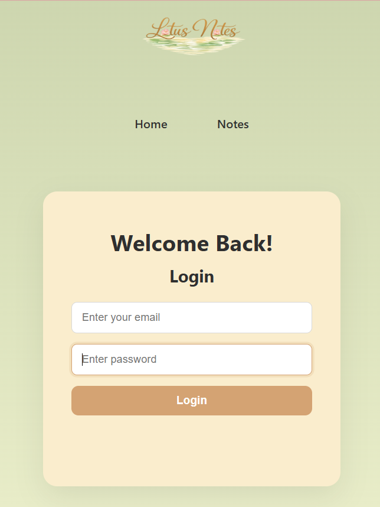
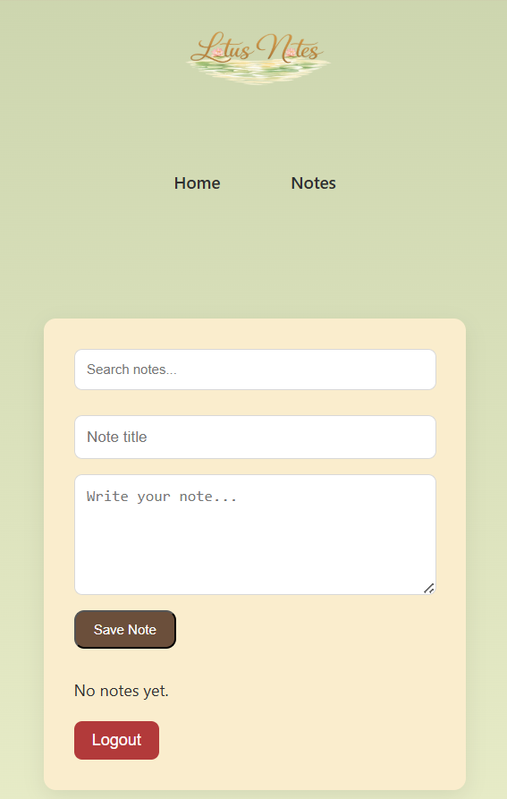
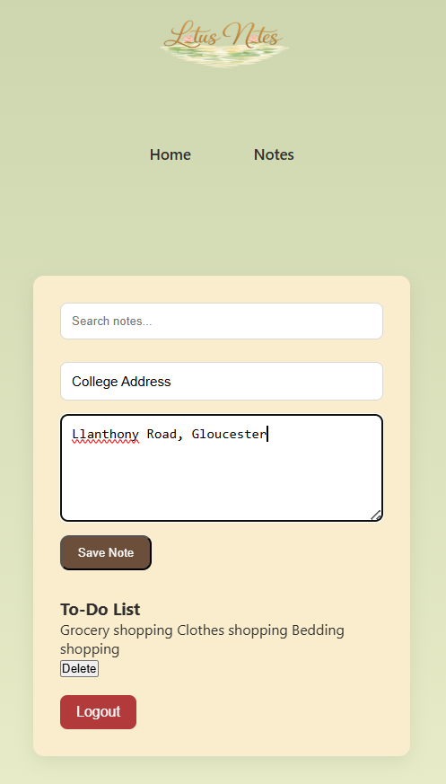
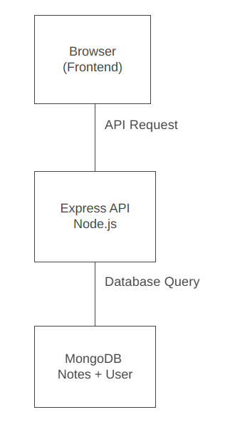

# Lotus Notes – Secure Notes Web Application

A full-stack secure notes application that allows users to create, view, and manage personal notes after authenticating with Auth0. Each user’s notes are securely stored in a database and isolated from other users.

This project demonstrates practical teamwork experience building a **full-stack JavaScript application** with a frontend, backend API, and database integration.

---
# Contributors

Kim - Frontend development and UI design
Delali - Backend architecture and Integration, Database Design, and UI efficiency 

# Overview

Lotus Notes is a web-based note-taking application designed to help users securely store and manage personal notes. The application supports user authentication and ensures that each user's notes are stored and retrieved securely from the backend database.

The project evolved from a simple browser-based note system using local storage to a **multi-user database-driven application**, providing experience with backend development, API communication, and debugging real-world issues.

---

# Features

* Auth0-based login and logout
* Create and store personal notes
* Delete notes
* Notes stored in a database per user
* Auth-protected pages preventing unauthorized access
* Logout functionality
* Modular JavaScript architecture using ES Modules

---

# Tech Stack

Frontend

* HTML
* CSS
* JavaScript

Backend

* Node.js
* Express.js

Database

* MongoDB

Development Tools

* Visual Studio Code
* MongoDB VS Code Extension
* Browser Developer Tools

---

# Project Architecture

Client (Frontend)

* Handles user interface
* Sends API requests to the backend
* Displays notes returned from the server

Server (Backend)

* Processes note creation and deletion
* Communicates with the database

Database

* Stores notes collection
* Associates notes with Auth0 user IDs

Example application flow:

```
User signs in with Auth0
     ↓
Frontend receives authenticated user profile
     ↓
User creates notes
     ↓
Notes stored in MongoDB
     ↓
Frontend fetches user-specific notes
```

---

# Installation and Setup

Clone the repository:

```
git clone https://github.com/KimberlyM076/secure-notes-app.git
```

Navigate to the project folder:

```
cd lotus-notes-app
```

Install dependencies:

```
npm install
npm --prefix Backend install
```

Start the server:

```
npm start
```

Open the application in your browser:

```
http://localhost:5000
```

Auth0 local settings used by this project:

* Callback URL: `http://localhost:5000/notes.html`
* Logout URL: `http://localhost:5000/`
* Web Origin: `http://localhost:5000`

Netlify deployment settings (frontend):

* Site URL: `https://lotus-notes.netlify.app`
* Callback URL: `https://lotus-notes.netlify.app/notes.html`
* Logout URL: `https://lotus-notes.netlify.app/`
* Web Origin: `https://lotus-notes.netlify.app`

For Netlify static hosting, keep `auth-config.json` at the project root so it is served at `/auth-config.json`.
Set these keys in that file:

* `domain`
* `clientId`
* `redirectUri`
* `logoutRedirectUri`
* `apiBaseUrl` (your deployed backend URL)

---

# Folder Structure

```
lotus-notes-app
│
├── Backend
│   ├── models
│   │   └── Notes.js
│   ├── node_modules
│   ├── .env
│   ├── .gitignore
│   ├── server.js
│   │── package.json
│   └── package-lock.json
│       
├── css
│   └── style.css
|
├── js
│  ├── auth.js
│  ├── notes.js
|  └── main.js
|
├── images (folder for all images used in the app)
|
├── index.html
├── notes.html
├── login.html
├── manifest.json
├── service-worker.js
├── documentation.md
├── Project Development Log.docx
├── README.md

```

---

# Delali
# Key Learning Outcomes

This project provided hands-on experience with full-stack development concepts including:

* Building RESTful APIs
* Integrating a frontend with a backend server
* Managing application state across client and server
* Integrating third-party authentication (Auth0)
* Working with a NoSQL database
* Structuring modular JavaScript applications
* Debugging frontend and backend integration issues

During development several real-world issues were identified and resolved, including:

* Duplicate event listeners causing repeated API requests
* Browser ES module import errors
* Callback route and redirect URI mismatches during Auth0 setup
* Ensuring users only access their own notes

---

# Future Improvements

Planned improvements include:

* Note editing functionality
* Search and filtering for notes
* Rich text support for note content
* Deployment to a cloud platform
* Role-based authorization for shared notes

---

# Screenshots




The following User Authentication Flow illustrates how user authentication is handled in the application:
Auth0 Flow:
1. User clicks Continue with Auth0.
2. Auth0 handles authentication and redirects to `/js/callback`.
3. Frontend uses the Auth0 user ID to create and fetch notes from the backend.



---

# Author Kim
Developed the frontend of the application, including the user interface design and implementation using HTML, CSS, and JavaScript. Responsible for creating the login page, notes dashboard, and note creation form, as well as ensuring a responsive and user-friendly design.

# Author Delali
Developed as part of a learning project to gain practical experience with full-stack JavaScript development and modern web technologies which was my main role in the project (Not the structuring i.e. HTML and styling i.e. CSS of the app).


Final Look
App link: https://lotusnotes-kidelim.netlify.app/
